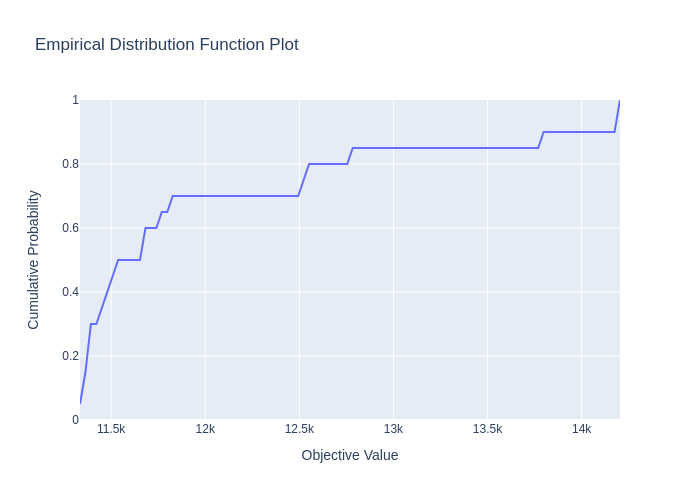

# CS5228-G18

## Introduction
This project is a part of the CS5228 Machine Learning course at the National University of Singapore. For more details, please visit the [Kaggle competition page](https://www.kaggle.com/c/cs5228-2019spring-project). The objective of this project is to build a model that accurately predicts the resale prices of HDB (Housing & Development Board) flats in Singapore.

## Project Structure

The project is organized into the following directories and files:

\```
.
├── data
│   ├── auxiliary-data
│   ├── auxiliary-data-preprocessed
│   ├── test_cleaned.csv
│   ├── test.csv
│   ├── train_cleaned.csv
│   └── train.csv
├── data_preprocess.ipynb
├── EDA.ipynb
├── main.py
├── README.md
└── result
    └── submission.csv
\```

### Directories and Files

- `data`: Contains the raw and preprocessed data files.
  - `auxiliary-data`: Contains additional data files.
  - `auxiliary-data-preprocessed`: Contains preprocessed auxiliary data files.
  - `test_cleaned.csv`: Cleaned test data file.
  - `test.csv`: Raw test data file.
  - `train_cleaned.csv`: Cleaned train data file.
  - `train.csv`: Raw train data file.
- `data_preprocess.ipynb`: Jupyter notebook for data preprocessing.
- `EDA.ipynb`: Jupyter notebook for Exploratory Data Analysis (EDA).
- `main.py`: Main Python script containing the implementation of machine learning models.
- `README.md`: This file, providing an overview of the project.
- `result`: Contains the output results of the predictions.
  - `submission.csv`: Sample prediction output file.

## Getting Started

1. Clone the repository to your local machine. And download the data files from the [Kaggle competition page](https://www.kaggle.com/c/cs5228-2019spring-project/data).
2. Install the required Python packages by running `pip install -r requirements.txt` (if provided) or install the necessary packages individually (e.g., pandas, scikit-learn, xgboost, lightgbm, optuna, etc.).
3. Open the `data_preprocess.ipynb` and `EDA.ipynb` notebooks in Jupyter to view the data preprocessing and exploratory data analysis steps, respectively.
4. Run the `main.py` script to execute the machine learning models and generate predictions.
5. Visualize the results using optuna-dashboard. Details are shown in the Visualization subsection.

## Models

The project explores various machine learning models, including:

- Linear Regression
- LightGBM
- Gradient Boosting Tree
- Random Forest (with GPU support)
- XGBRegressor (with GPU support)

## Evaluation

Models are evaluated using cross-validation, and hyperparameter tuning is performed using GPU-supported frameworks like Optuna. The performance of each model is compared to identify the best performing model for predicting HDB resale prices.

### Hyperparameter Tuning Visualization

```console
$ pip install optuna-dashboard
$ optuna-dashboard sqlite:///example-study.db
```

Please check out [the GitHub repository](https://github.com/optuna/optuna-dashboard) for more details.

| Manage Studies | Visualize with Interactive Graphs |
|---|---|
|  |  |

#### Visualization of Our Best Model
Visualize the optimization history. 

Visualize high-dimensional parameter relationships.

Visualize individual hyperparameters as slice plot.

Visualize parameter importances.

Visualize empirical distribution function.



